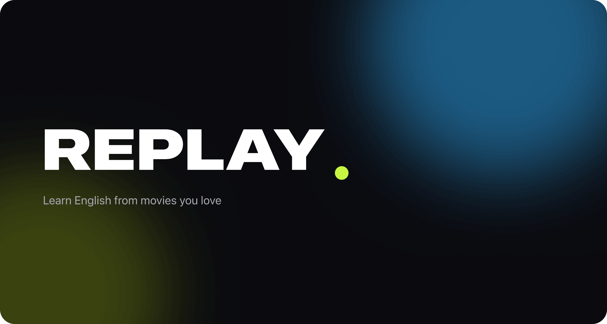

  

# Replay

Replay is a native iOS app that turns movie dialogue into practical English lessons.
Discover films, retrieve matching English subtitles, and learn vocabulary and expressions
in the context in which they are actually used.

  

## How it works

1. Find a film and explore its details.
2. Select the best available English subtitles.
3. Build a focused lesson from authentic dialogue and study each word in context.

## Technology

Replay is built with SwiftUI using a modular MVVM architecture, Observation for UI state,
Swift Concurrency for asynchronous workflows, state-driven navigation, and dependency
injection. Movie and subtitle data are provided by TMDB and OpenSubtitles.

Artwork shown in this README was AI-generated for this project.
